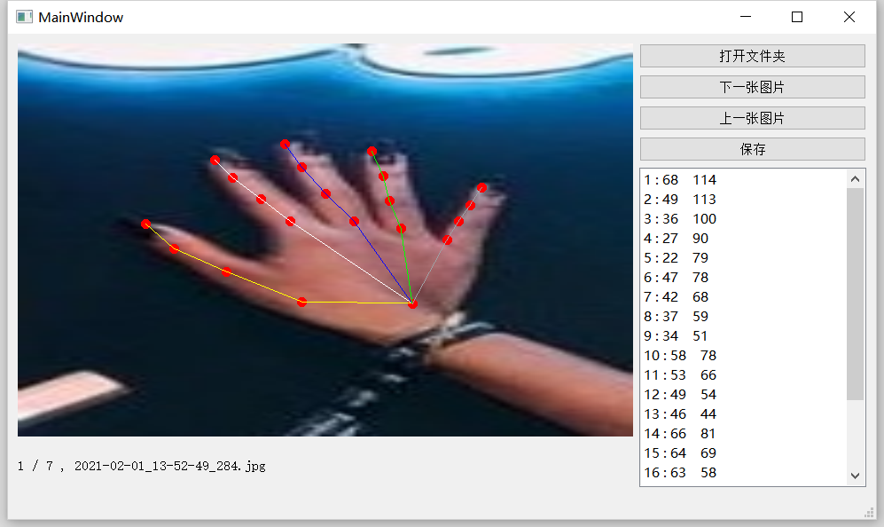

# 手部21点数据集修改

本代码作用是使用[手部21点检测](https://github.com/EricLee2021-72324/onnx_run)增加数据集使用，使用预训练模型后，数据集存在一定误差，使用本程序可以实现可视化修改数据集，拖动标点会相应的对 .json 格式数据集进行修改。

## 使用方法：

安装Qt Creator 运行程序mylandmark.pro。

## 存在问题

图片和数据集文件需要在同一文件夹下，且同名

## 修改数据集格式

修改 mainwindow.cpp文件中的 writeJsonFile() 和 readJsonFile()俩个函数即可。

## 著作者

方玉杰(在读研究生)
隶属于杭州电子科技大学
